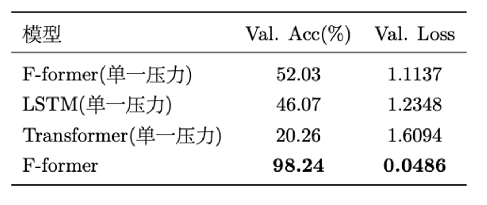
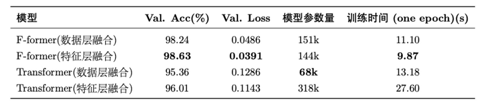
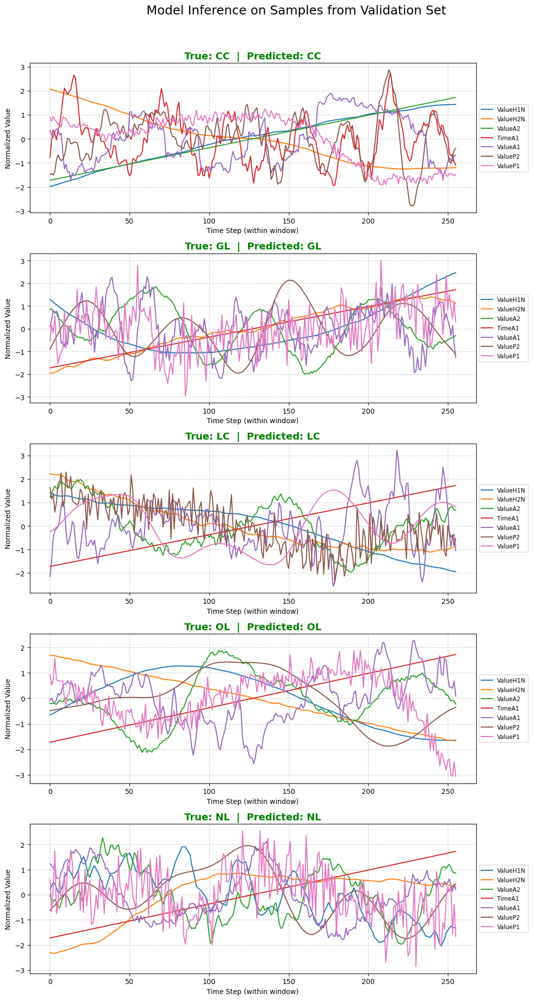

# 管道泄漏检测机器学习模型

这是中国石油大学(华东) 2025 年小学期计算机科学与技术人工智能方向的实践, 


## 1. 数据准备 (使用 `washLeakData.py`)

此脚本用于将原始的传感器CSV文件和声学RAW文件转换为适合模型训练的结构化数据。

-   **数据来源**: 请先从 [Dataset of Leak Simulations in Experimental Testbed Water Distribution System.](https://data.mendeley.com/datasets/tbrnp6vrnj/1) 下载并解压原始数据。由于这个数据集中存在两种传感器频率(25600Hz, 8000Hz), 并且结合我们的特征融合和数据层融合方法, 有两个处理方式.
-   **配置**:
    -   打开 `washLeakData.py` 文件。
    -   修改 `root_directory_str` 为你原始数据所在的目录路径。
    -   修改 `save_DIR` 为你希望保存处理后数据的目标目录。
    -   `needDataAlignment` 变量是关键：
        -   设置为 `True`：对声学数据和其他传感器数据进行时间对齐并合并，生成一个CSV文件（用于单路输入模型）。
        -   设置为 `False`：声学数据与其他传感器数据独立保存，生成两个CSV文件（用于双路输入模型）。
-   **运行**:
    ```bash
    python washLeakData.py
    ```
    运行后，处理好的CSV文件将保存在 `save_DIR` 目录下。

## 2. 模型训练 (使用主训练脚本)

本部分基于预处理后的数据，训练各种时序分类模型。

-   **支持的模型**:
    -   **单路输入模型**: LSTM, Transformer, FFT, CNN。
    -   **双路对齐模型**: PairedFFTTransformer, PairedTransformer。
-   **核心配置**:
    所有训练相关的参数都集中在主训练脚本中的 `config`, `model_config`, `dataset_config` 字典里。
    -   `config`：控制训练过程的全局参数（如批大小、学习率、模型类型）。
    -   `model_config`：定义每种模型的具体超参数。
    -   `dataset_config`：配置数据加载细节，针对单路 (`"Data"`) 或双路 (`"Model"`) 数据。
-   **关键配置**:
    -   在 `config` 字典中，根据你数据准备阶段选择的模式，设置 `config["alignment"]` 为 `"Data"`（对应 `washLeakData.py` 的 `needDataAlignment = True`）或 `"Model"`（对应 `washLeakData.py` 的 `needDataAlignment = False`）。
    -   根据你想训练的模型，设置 `config["model"]` 为相应的模型名称。
-   **运行**:
    
    针对单路输入模型
    ```bash
    python leakTrain.py 
    ```

    针对双路对齐模型
    ```bash
    python trainModelAlignment.py
    ```

## 使用流程总结

1.  **下载原始数据** 并解压。
2.  **编辑 `washLeakData.py`** 中的路径和 `needDataAlignment`，然后运行它进行数据预处理。
3.  **编辑主训练脚本** 中的 `config`, `model_config`, `dataset_config`，特别注意 `config["alignment"]` 和 `config["model"]` 的设置。
4.  **运行主训练脚本** 开始模型训练。


## 模型和训练结果
### 模型结构图
模型在处理单路对齐数据的时候的结构图


模型在处理未对齐数据的时候的结构图

### 实验结果





